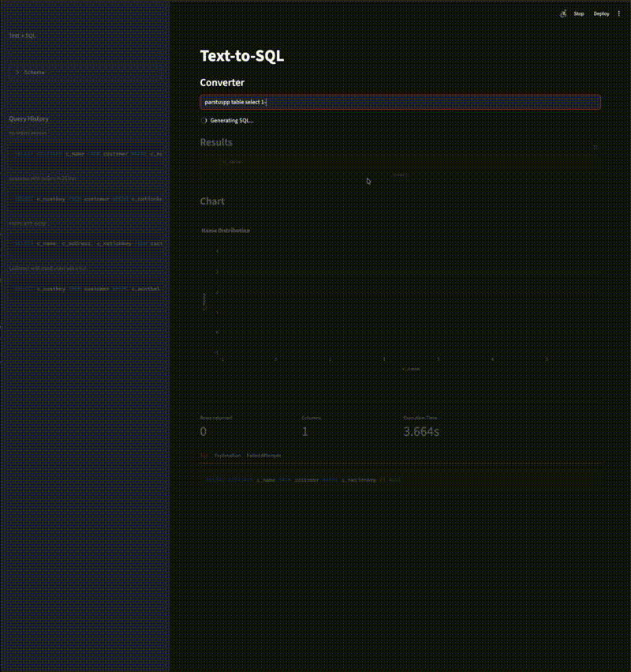

# Text-to-SQL

A local AI-powered Streamlit app that converts plain-English questions into SQL queries, runs them against a DuckDB database, and automatically generates charts from the results — all using a local LLM with no API keys required.




---

## Tech Stack

| Layer | Technology |
|---|---|
| UI | [Streamlit](https://streamlit.io) |
| LLM | [Ollama](https://ollama.com) + `gemma3:1b` |
| Database | [DuckDB](https://duckdb.org) (TPC-H benchmark data) |
| Visualization | [Plotly](https://plotly.com/python/) |
| Data validation | [Pydantic](https://docs.pydantic.dev) |

---

## Prerequisites

- Python 3.10+
- [Ollama](https://ollama.com/download) installed and running
- The `gemma3:1b` model pulled locally

---

## Setup

**1. Clone the repo**
```bash
git clone <your-repo-url>
cd text-to-sql
```

**2. Install Python dependencies**
```bash
pip install -r requirements.txt
```

**3. Pull the model**
```bash
ollama pull gemma3:1b
```

**4. Run the app**
```bash
streamlit run app_ui.py
```

Streamlit will open in a new tab automatically

> Ollama will start automatically if it isn't already running.

---

## How It Works

1. On startup, DuckDB loads the TPC-H benchmark dataset (scale factor 0.1)
2. The app introspects the schema and includes it in every prompt
3. The user's question is sent to `gemma3:1b` via Ollama with a structured output schema
4. The model returns a SQL query + explanation as JSON
5. The query is executed against DuckDB and results are displayed as a dataframe
6. If execution fails, the error is fed back into the next prompt (up to 3 retries)
7. A visualization agent decides what to visualize

---

## Project Structure
 
```
├── app_ui.py                # Streamlit UI
├── llm_agent.py             # SQL generation agent with retry logic
├── viz_agent.py             # Chart selection and rendering agent
├── error_agent.py           # Error analysis agent
├── schema_loader.py         # DuckDB setup and schema introspection
├── chat_response_model.py   # Pydantic model for SQL + explanation response
├── visualization_model.py   # Pydantic model for chart config response
├── error_analysis_model.py  # Pydantic model for error analysis response
└── requirements.txt
```

---

## Example Questions

- *What are the top 10 customers by total order value?*
- *How many orders were placed each month in 1995?*
- *Which supplier has the highest average part price?*
- *Show me all line items where the discount is greater than 5%*

---

## Configuration

To swap the model, edit `llm_agent.py`:
```python
response = chat(model='gemma3:1b', ...)  # replace with any Ollama model
```

To use a different database, replace the `create_db()` function in `schema_loader.py` with your own DuckDB connection.
